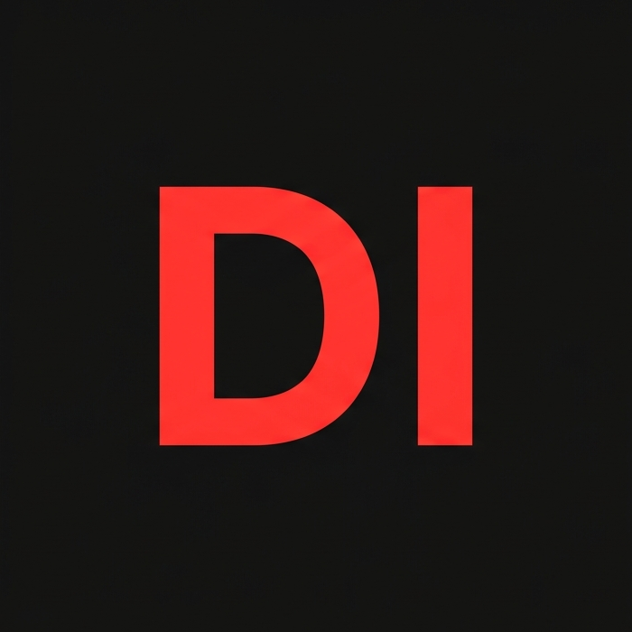

<!--* PROJECT SHIELDS -->
[![Contributors][contributors-shield]][contributors-url]
[![Forks][forks-shield]][forks-url]
[![Stargazers][stars-shield]][stars-url]
[![Issues][issues-shield]][issues-url]
[![GPL-3.0][license-shield]][license-url]

<!--* PROJECT LOGO -->
 

  

<h3 align="center">Display Image</h3>

  

    A static website created using HTML/CSS/JS that lets you view your images in fullscreen.
     
    <a href="https://github.com/xradmir1/display-image"><strong>Explore the docs »</strong></a>
     
     
    <a href="https://github.com/xradmir1/display-image">View Demo</a>
    &middot;
    <a href="https://github.com/xradmir1/display-image/issues/new?labels=bug">Report Bug</a>
    &middot;
    <a href="https://github.com/xradmir1/display-image/issues/new?labels=enhancement">Request Feature</a>
  

<!--* TABLE OF CONTENTS -->

  
Table of Contents

  <ol>
    <li>
      <a href="#about-the-project">About The Project</a>
      <ul>
        <li><a href="#built-with">Built With</a></li>
      </ul>
    </li>
    <li><a href="#usage">Usage</a></li>
    <li><a href="#roadmap">Roadmap</a></li>
    <li><a href="#license">License</a></li>
    <li><a href="#contact">Contact</a></li>
    <li><a href="#acknowledgments">Acknowledgments</a></li>
  </ol>

<!--* ABOUT THE PROJECT -->
## About The Project

A lightweight web utility designed for clean image viewing. Users can upload any image file, which replaces the default QR code, and click the image to trigger a smooth fullscreen mode.

**Key Features:**
*   Dynamic image preview using `URL.createObjectURL`.
*   Fullscreen API integration for immersive viewing.
*   Custom-styled floating upload button with CSS animations.

(<a href="#readme-top">back to top</a>)

### Built With

* [![HTML5][HTML-shield]][HTML-url]
* [![CSS3][CSS-shield]][CSS-url]
* [![JavaScript][JS-shield]][JS-url]

(<a href="#readme-top">back to top</a>)

<!--* USAGE EXAMPLES -->
## Usage

1. Click the floating upload icon at the bottom of the card.
2. Select any image from your local system.
3. Click the displayed image to enter fullscreen mode.
4. Press `Esc` to exit fullscreen.

(<a href="#readme-top">back to top</a>)

<!--* ROADMAP -->
## Roadmap

- [x] Basic HTML/CSS Layout
- [x] Image Upload Logic
- [x] Fullscreen API Integration
- [ ] Add image filters (Brightness/Contrast)
- [ ] Support for multiple image uploads (Gallery mode)

(<a href="#readme-top">back to top</a>)

<!--* LICENSE -->
## License

Distributed under the GPL-3.0 License. See `LICENSE` for more information.

(<a href="#readme-top">back to top</a>)

<!--* CONTACT -->
## Contact

**Radmir Xayrullayev**\
[![Telegram][telegram-shield]][telegram-url]
[![Discord][discord-shield]][discord-url]
[![Gmail][gmail-shield]][gmail-url]

Project Link: [https://github.com/xradmir1/display-image](https://github.com/xradmir1/display-image)

(<a href="#readme-top">back to top</a>)

<!--* ACKNOWLEDGMENTS -->
## Acknowledgments

* [Frontend Mentor](https://www.frontendmentor.io) for the initial design challenge.
* [Choose A License](https://choosealicense.com/) for GPL-3.0 guidance.
* Also thanks to: [Obsidian](https://obsidian.md/), [VS Code](https://code.visualstudio.com/), [Google Gemini](https://gemini.google.com/), [web.dev](https://web.dev/), [md-badges](https://github.com/inttter/md-badges), [MDN Web Docs](https://developer.mozilla.org/en-US/), [Arch Linux](https://archlinux.org/), [GitHub](https://github.com/).

     

(<a href="#readme-top">back to top</a>)

<!--* MARKDOWN LINKS & IMAGES -->
[contributors-shield]: https://img.shields.io/github/contributors/xradmir1/display-image.svg?style=for-the-badge
[contributors-url]: https://github.com/xradmir1/display-image/graphs/contributors
[forks-shield]: https://img.shields.io/github/forks/xradmir1/display-image.svg?style=for-the-badge
[forks-url]: https://github.com/xradmir1/display-image/network/members
[stars-shield]: https://img.shields.io/github/stars/xradmir1/display-image.svg?style=for-the-badge
[stars-url]: https://github.com/xradmir1/display-image/stargazers
[issues-shield]: https://img.shields.io/github/issues/xradmir1/display-image.svg?style=for-the-badge
[issues-url]: https://github.com/xradmir1/display-image/issues
[license-shield]: https://img.shields.io/github/license/xradmir1/display-image.svg?style=for-the-badge
[license-url]: https://github.com/xradmir1/display-image/blob/main/LICENSE
[HTML-shield]: https://img.shields.io/badge/HTML5-E34F26?style=for-the-badge&logo=html5&logoColor=white
[HTML-url]: https://developer.mozilla.org/en-US/docs/Web/HTML
[CSS-shield]: https://img.shields.io/badge/CSS3-1572B6?style=for-the-badge&logo=css3&logoColor=white
[CSS-url]: https://developer.mozilla.org/en-US/docs/Web/CSS
[JS-shield]: https://img.shields.io/badge/JavaScript-F7DF1E?style=for-the-badge&logo=javascript&logoColor=black
[JS-url]: https://developer.mozilla.org/en-US/docs/Web/JavaScript
[telegram-shield]: https://img.shields.io/badge/Telegram-2CA5E0?style=for-the-badge&logo=telegram&logoColor=white
[telegram-url]: https://t.me/xradmir1
[discord-shield]: https://img.shields.io/badge/Discord-5865F2?style=for-the-badge&logo=discord&logoColor=white
[discord-url]: https://discord.com/users/1196074939757887549
[gmail-shield]: https://img.shields.io/badge/Gmail-D14836?style=for-the-badge&logo=gmail&logoColor=white
[gmail-url]: mailto:radmirxayrullayev@gmail.com